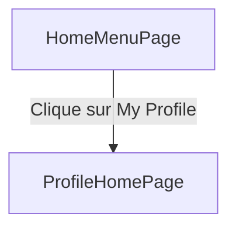
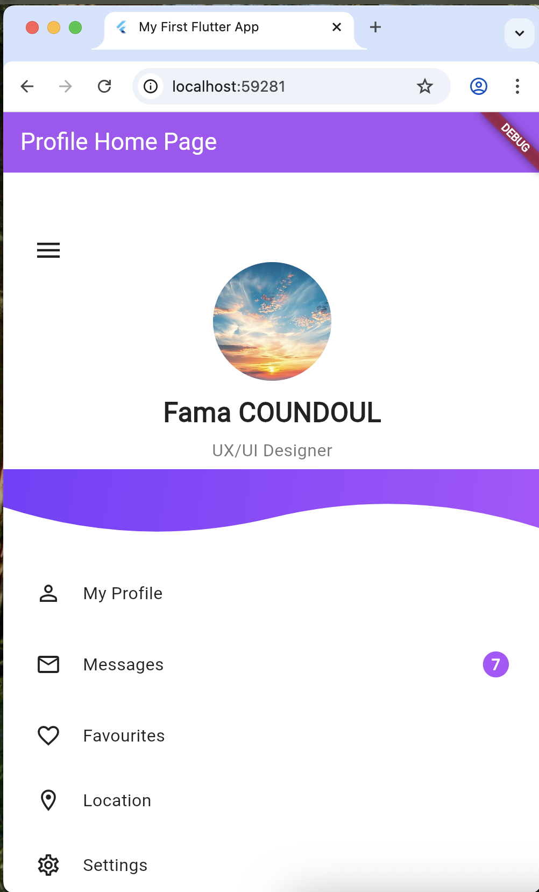
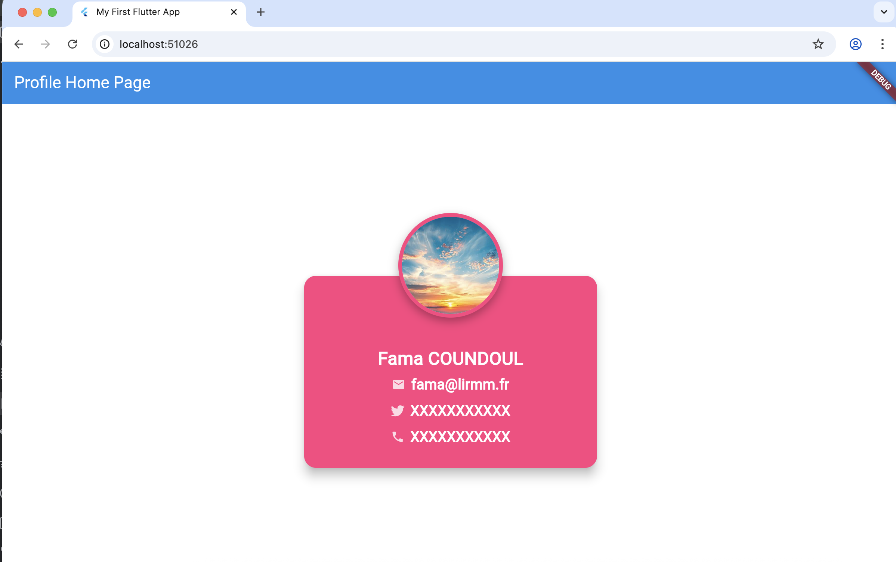

#  Exercice 1 : Application Flutter – Page d’Accueil + Carte de Profil

##  Objectif de l'Exercice

L’objectif de cet exercice est d’implémenter une mini-application Flutter composée de :

1. **Une page d’accueil moderne (HomeMenuPage)** avec :

    * une photo de profil,
    * le nom et la fonction professionnelle,
    * une vague décorative (wave clip),
    * un menu interactif (My Profile, Messages, etc.).

2. **Une page de profil détaillée (ProfileHomePage)** présentant une carte de profil avec :

    * l’avatar,
    * le nom,
    * les informations personnelles (email, téléphone, réseaux sociaux).

3. **Un système de navigation** permettant d’accéder à ProfileHomePage via la rubrique **My Profile**.

Cet exercice permet de maîtriser :

* les widgets de mise en page avancée (Stack, ClipPath, CustomClipper),
* la navigation Flutter (`Navigator.push`),
* la création de composants UI réutilisables,
* la structuration d'une interface mobile professionnelle.

---

##  Structure du Projet

```
lib/
 ├─ main.dart
 ├─ HomeMenuPage.dart       ← Page d’accueil avec menu + vague
 ├─ ProfileHomePage.dart    ← Page carte de profil
assets/
 ├─ profile.png
 ├─ rendu.png
```

---

##  Navigation Principale (main.dart)

Le fichier `main.dart` initialise l’application et affiche la page d’accueil :

```dart
import 'package:flutter/material.dart';
import 'HomeMenuPage.dart';

void main() {
  runApp(const MyApp());
}

class MyApp extends StatelessWidget {
  const MyApp({super.key});

  @override
  Widget build(BuildContext context) {
    return MaterialApp(
      debugShowCheckedModeBanner: false,
      home: const HomeMenuPage(),
    );
  }
}
```

---

##  Page d’Accueil : `HomeMenuPage`

La page d’accueil affiche :

* une **photo de profil**,
* un **nom + titre professionnel**,
* une **vague graphique** identique au design de référence,
* une **liste de rubriques**,
* un bouton **Logout**.

 Lorsque l’utilisateur clique sur **My Profile**, il est redirigé vers la page `ProfileHomePage` grâce à :

```dart
Navigator.push(
  context,
  MaterialPageRoute(builder: (_) => const ProfileHomePage()),
);
```

La page inclut :

* un **header gradient**,
* une **double vague CustomClipper**,
* un menu interactif.

---

##  Page Profil : `ProfileHomePage`

Cette page affiche une carte de profil reprenant les éléments suivants :

* Avatar circulaire avec ombre,
* Nom complet,
* Email,
* Réseaux sociaux / Téléphone,
* Carte stylisée (Widget `Card`),
* Mise en page centrée à l’aide de `Stack` et `Column`.

Elle reprend les principes décrits dans la version précédente du README , notamment :

* séparation en méthodes `_buildProfileCard` et `_buildAvatar`,
* utilisation d’icônes (email, Twitter, téléphone),
* design responsive grâce aux contraintes de largeur max.

---

##  Schéma de Navigation



---

## ️ Aperçu des Interfaces

### 📍 Page d’accueil (HomeMenuPage)

```

```

### 📍 Page Profil (ProfileHomePage)

```

```

---

##  Exécution de l'Application

1. Assure-toi d'avoir Flutter installé.
2. 
4. Lance l’application :

```sh
flutter run
```

---

##  Résultat Attendu

* Une page d’accueil moderne et responsive.
* Une navigation fluide vers la page de profil.
* Un design professionnel basé sur Stack, ClipPath, Card et CircleAvatar.
* Un code propre, bien structuré et facilement extensible.

---

